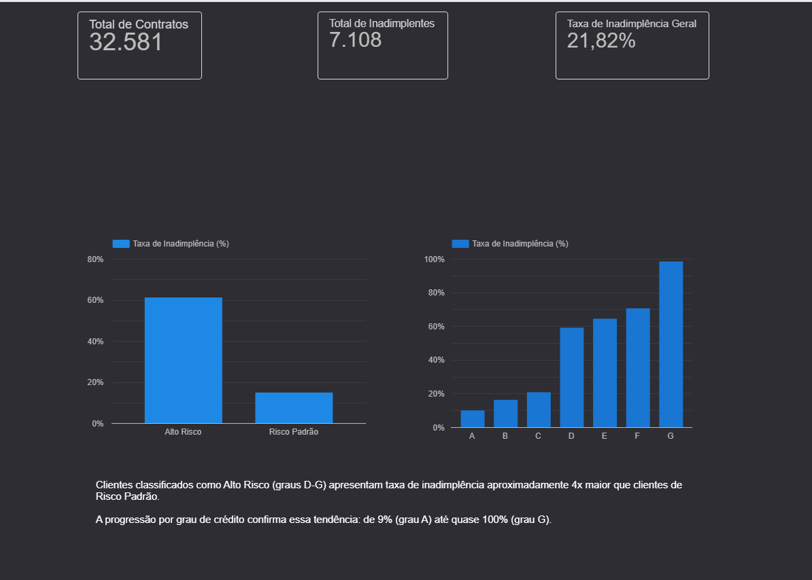
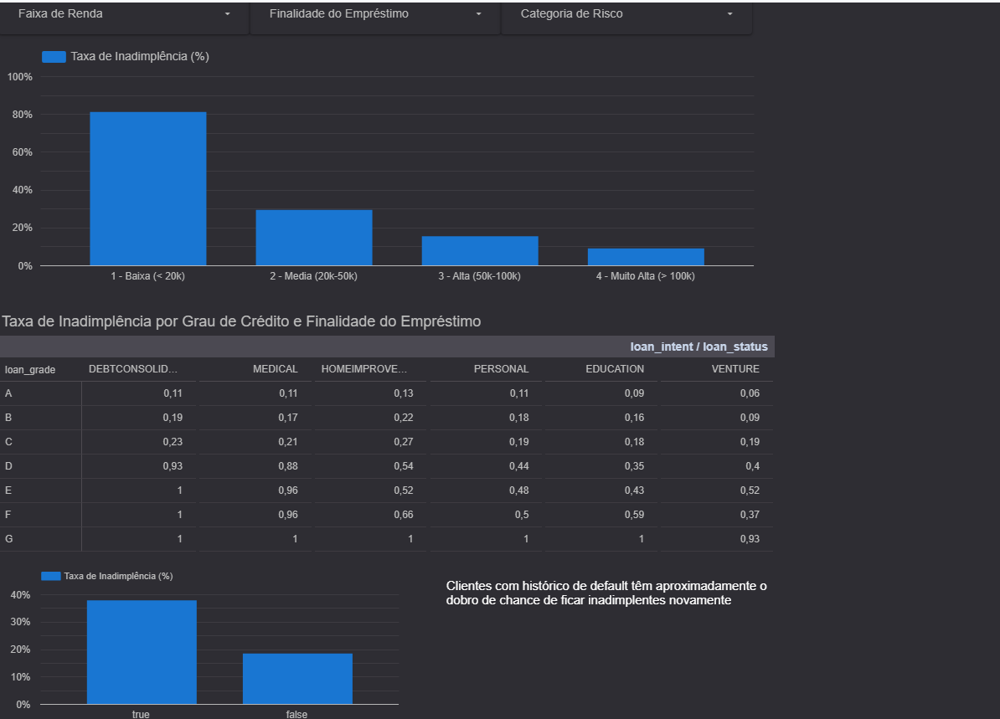
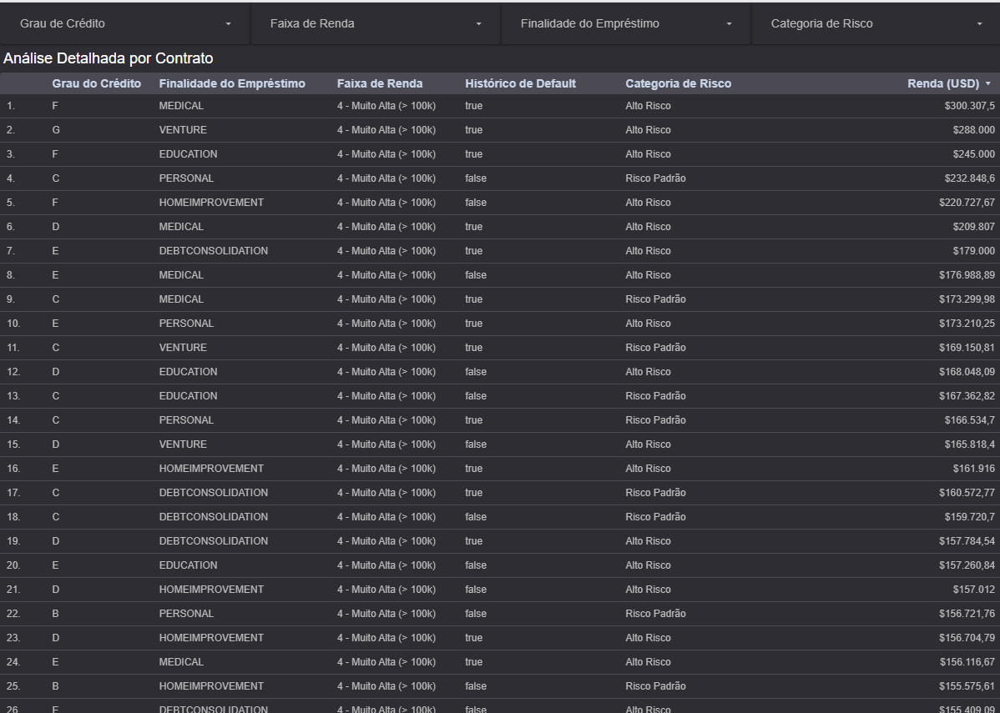

# Dashboard de Análise de Inadimplência de Crédito (Looker Studio)

Dashboard interativo em Looker Studio para análise de risco de crédito, construído sobre a mesma base de dados utilizada no projeto de [Análise de Inadimplência com SQL (BigQuery)](https://github.com/alanbarion/analise-inadimplencia-credito-sql).

**Acesse o dashboard:** https://datastudio.google.com/reporting/f969c49e-b98e-4a9b-af6b-fa9c17f4faf9

## Sobre o projeto

Este projeto é a segunda entrega de uma série que utiliza a mesma base de dados de crédito para demonstrar diferentes formas de gerar valor a partir dos dados:

1. **SQL (BigQuery)** — consultas ad-hoc para responder perguntas de negócio pontuais (agregações, CASE WHEN, funções de janela, CTEs)
2. **Looker Studio** (este projeto) — dashboard executivo, visual e interativo, para consumo por áreas de negócio sem conhecimento técnico

A mesma pergunta de negócio, respondida de duas formas diferentes, dependendo de quem vai consumir a informação e como.

## Perguntas de negócio respondidas

- Qual a taxa de inadimplência por faixa de renda, finalidade do empréstimo e grau de crédito?
- Como o risco se distribui entre clientes classificados como "Alto Risco" (graus D-G) e "Risco Padrão" (graus A-C)?
- Clientes com histórico prévio de default têm maior propensão a repetir a inadimplência?

## Estrutura do dashboard

**Página 1 — Visão Geral**
KPIs principais (total de contratos, total de inadimplentes, taxa geral de inadimplência) e comparativo de risco por categoria e por grau de crédito individual (A a G).

**Página 2 — Perfil de Risco**
Cruzamento de inadimplência por faixa de renda, finalidade do empréstimo e grau de crédito, além do comparativo entre clientes com e sem histórico de default anterior.

**Página 3 — Explorador de Dados**
Tabela detalhada com filtros livres combinados, para exploração ponto a ponto da base.

## Modelagem de dados

Para otimizar a performance do dashboard, foram criadas duas views no BigQuery, construídas em camadas (uma consome a outra):

- **`vw_credito_analitico`** — view analítica no nível de contrato, com faixa de renda e categoria de risco já calculadas via `CASE WHEN`, servindo como fonte principal para filtros e gráficos interativos
- **`vw_kpis_resumo`** — view agregada com taxas de inadimplência pré-calculadas (`SAFE_DIVIDE`), otimizada para os cards de KPI

O SQL de ambas está disponível na pasta [`sql/`](./sql).

## Principais achados

- A faixa de renda mais baixa (< $20k) concentra a maior taxa de inadimplência, com queda consistente à medida que a renda aumenta
- A progressão de risco por grau de crédito é clara: de ~9% (grau A) a praticamente 100% (grau G)
- Clientes com histórico prévio de default têm aproximadamente o dobro de chance de ficar inadimplentes novamente (~38% vs ~18%)

## Fonte dos dados

Dataset público **Credit Risk Dataset**, disponível no Kaggle: https://www.kaggle.com/datasets/laotse/credit-risk-dataset

Os dados foram carregados no BigQuery para fins de análise, na tabela `projeto-dados-coursera-494623.credito_risco.emprestimos`.

## Ferramentas utilizadas

Google BigQuery (SQL, views) · Looker Studio (visualização e dashboard)

---

# Credit Default Analysis Dashboard (Looker Studio)

Interactive Looker Studio dashboard for credit risk analysis, built on top of the same dataset used in the [Credit Default Analysis with SQL (BigQuery)](https://github.com/alanbarion/analise-inadimplencia-credito-sql) project.

**View the dashboard:** https://datastudio.google.com/reporting/f969c49e-b98e-4a9b-af6b-fa9c17f4faf9

## About the project

This project is the second entry in a series that uses the same credit dataset to demonstrate different ways of delivering value from data:

1. **SQL (BigQuery)** — ad-hoc queries to answer specific business questions (aggregations, CASE WHEN, window functions, CTEs)
2. **Looker Studio** (this project) — executive, visual, interactive dashboard for business stakeholders without technical background

The same business question, answered in two different ways, depending on who consumes the information and how.

## Business questions answered

- What is the default rate by income bracket, loan purpose, and credit grade?
- How is risk distributed between "High Risk" (grades D-G) and "Standard Risk" (grades A-C) customers?
- Are customers with a prior default history more likely to default again?

## Dashboard structure

**Page 1 — Overview**
Key KPIs (total contracts, total defaults, overall default rate) and risk comparison by category and individual credit grade (A to G).

**Page 2 — Risk Profile**
Default rate breakdown by income bracket, loan purpose, and credit grade, plus a comparison between customers with and without a prior default history.

**Page 3 — Data Explorer**
Detailed table with combined free filters for row-level exploration.

## Data modeling

To optimize dashboard performance, two layered views were created in BigQuery (one consumes the other):

- **`vw_credito_analitico`** — contract-level analytical view, with income bracket and risk category pre-calculated via `CASE WHEN`, serving as the main source for interactive filters and charts
- **`vw_kpis_resumo`** — aggregated view with pre-calculated default rates (`SAFE_DIVIDE`), optimized for KPI cards

SQL for both views is available in the [`sql/`](./sql) folder.

## Key findings

- The lowest income bracket (< $20k) has the highest default rate, decreasing consistently as income increases
- Risk progression by credit grade is clear: from ~9% (grade A) to nearly 100% (grade G)
- Customers with a prior default history are roughly twice as likely to default again (~38% vs ~18%)

## Data source

Public **Credit Risk Dataset**, available on Kaggle: https://www.kaggle.com/datasets/laotse/credit-risk-dataset

Data was loaded into BigQuery for analysis purposes, in the table `projeto-dados-coursera-494623.credito_risco.emprestimos`.

## Tools used

Google BigQuery (SQL, views) · Looker Studio (visualization and dashboard)
